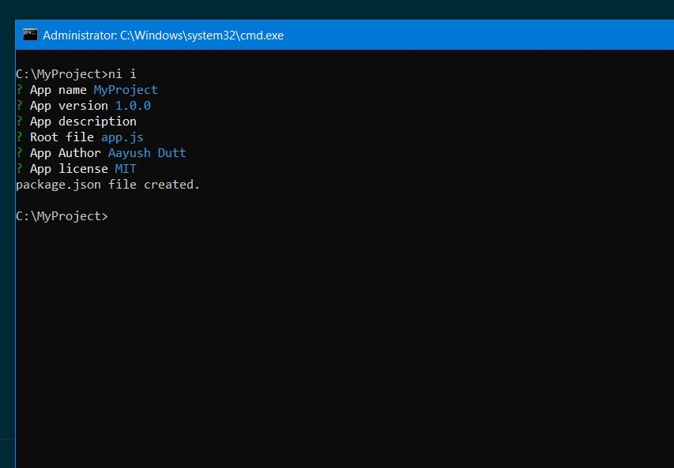

# NPM INIT Clone

## Installation:
* Type the command `git clone https://github.com/aayushdutt/ni-i.git && cd ni-i && npm start`
#### OR
* Clone the repository.
* `cd` into the cloned directory by `cd ni`.
* Run `npm start` in terminal.
* Ready to roll!

## Usage:
Check installation by `ni --version`.
Usage is similar as native `npm-init` (but a lot faster).

### `ni i` (or) `ni init`:
* Proceeds to the package.json creation wizard.

